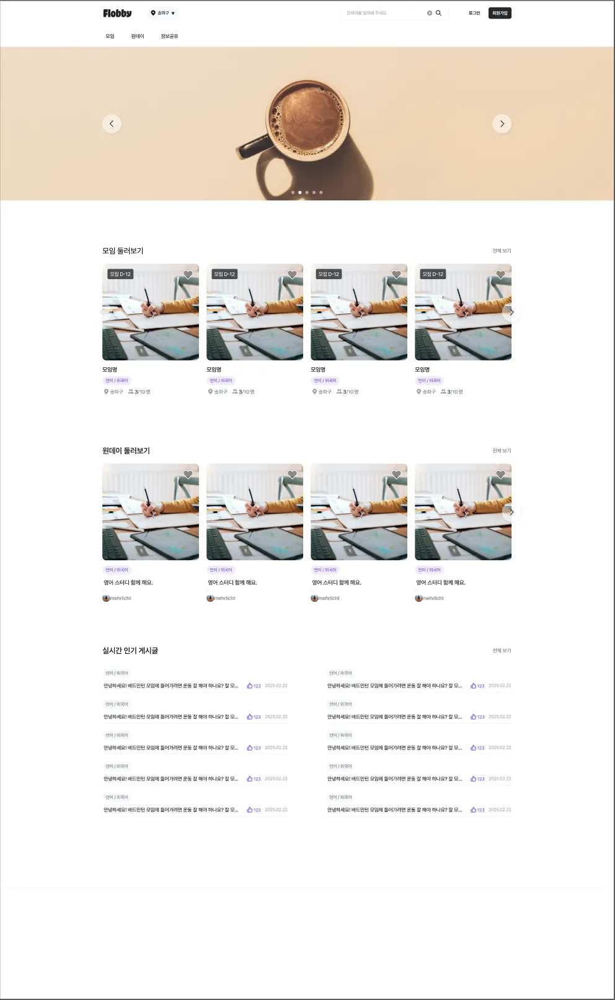
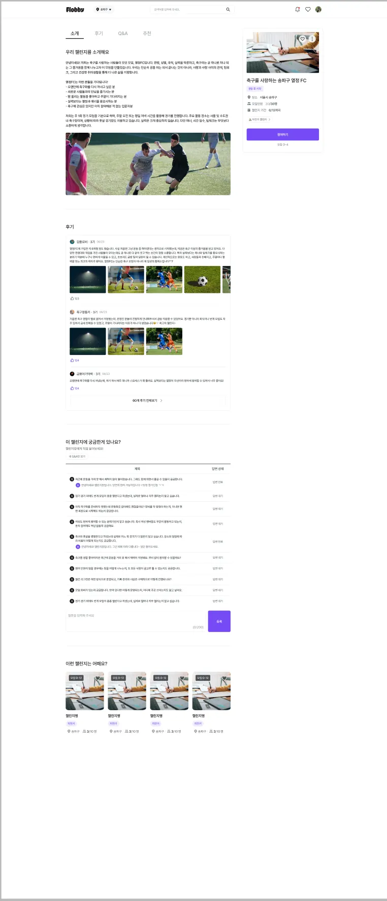

    

## 📖 목차

- [서비스 내용](#-서비스-내용)

- [개발 기간](#-개발-기간)

- [Team members](#-team-members)

- [기술 스택](#-기술-스택)

- [개발 내용](#-개발-내용)

    - [주요-기능](#주요-기능)

- [성장 경험](#-성장-경험)

- [서비스 화면](#-서비스-화면)

## 🌐 서비스 내용

> Flobby는 실행이 어려운 사용자🛌 를 위한 취미🧑🏻‍🎨 기반 챌린지 플랫폼🚉 입니다.

> 특히, 하고 싶은 것은 많지만🙆🏻‍♂️ 행동👣 으로 이어지지 않는 사용자 문제❓를 핵심으로 정의❗️했습니다.

> 하지만 대부분의 서비스가 높은 진입 장벽🧗🏻‍♂️ 과 지속력 부족🪫 에 대한 제약이 있습니다.

> 이에 챌린지⚡️ 라는 Gamification🎮 요소를 통해 참여🙋🏻‍♂️ 부터 목표 달성🎁 까지 사용자 행동 전환🔄 의 도움을 줄수 있는 플랫폼🚉 을 제공하는 “플로비” 서비스를 기획하게 되었습니다!

## 🗓️ 개발 기간

### **2024.11.19 ~ 2026.01.04**

## 👥 Team members

|                   이승우                   |                  김지민                  |                 김연지              |
|:---------------------------------------:|:-------------------------------------:|:-----------------------------------:|
| [Github](https://github.com/kelvin3476) | [Github](https://github.com/wlals4264) | [Github](https://github.com/ongzzzz)|

## 🛠️ 기술 스택

## ⭐ 개발 내용

## **주요 기능**

- 1️⃣ **지역 기능**

    - **공공데이터 지역 관할구 오픈 API 데이터 연동 (시, 도, 구)**
    - **관심 지역 및 선택 지역 기능**
    - **선택 지역에 따라 다양한 챌린지 게시물 표출**

- 2️⃣ **챌린지 기능**

    - **사용자 권한 구분 기능**
      - 챌린지장
      - 멤버
    - **피드**
      - 피드 생성, 수정, 삭제 기능 제공
      - 푸시 알림 기능 제공
      - Amazon S3에 이미지를 올려서 해당 이미지로 이미지 섬네일 표출
      - Drag and Drop 으로 이미지 업로드 기능 제공
      - 좋아요 및 댓글 기능 제공
    - **일정**
      - 일정 생성, 수정, 삭제, 참여 기능 제공
      - 푸시 알림 기능 제공
      - 캘린더 기능 제공
      - 좋아요 및 댓글 기능 제공

## 💡 **성장 경험**

### 서비스에 대한 관점

직접 서비스를 만들어가는 과정 속에서 고객 즉, 사용자 중심의 만족과 가치 제공, 그리고 감동과 신뢰를 주는 경험을 만드는 것이 핵심이라는 것을 알게 되었습니다. 단순히 기술적으로 화려한 제품이 서비스가 아닌 실제 사용자들이 겪고 있는 주요한 문제들을 해결하고 보다 나은 사용자 경험을 제공해 주는 것이 서비스를 제작하는 사람들이 공통적으로 가져야 할 마인드셋이라는 것을 되새기는 시간을 가졌습니다.

### 설계 능력

프런트엔드 개발로 참여하여 엔지니어링 관점에서 보았을 때 프런트엔드 아키텍처에 대한 설계를 늘 끊임없이 고민하고 공부해서 다양한 디자인 패턴을 (예: MVC, MVVM, Atomic Design Pattern) 적용해 보는 시간을 가지기 위해 노력하였습니다. 또한, 클라우드 서비스를 통하여 앞단 인프라를 구축하고 Nginx를 활용한 프락시 환경 구성부터 로컬, 개발, 상용 각 서비스 도메인을 나누어 보다 안정적이고 체계적인 인프라를 구축하기 위해 설계에 많은 고민과 시간을 투자하여 서비스에 적용시켰습니다.

### 협업 및 커뮤니케이션

서비스를 만들어가기 위해 기능 개발 전 충분한 가설 검증이 선행되어야 한다는 점을 배우고 초기 기술 스택 선택이 개발 속도에 미치는 영향을 체감하며 소규모 프로젝트에서 커뮤니케이션 비용 관리의 중요성을 더 인식하게 되고 그 외 팀원들과 일정 조율 및 관리와 같이 협업 관점에서 어려운 부분과 현실적으로 극복하기 힘든 부분을 깨닫고 한 단계 더 성장할 수 있는 기회였습니다.

## 👀 **서비스 화면**

|  |                                        |
|:-------------------------------------:|:--------------------------------------:|
|            메인 홈페이지 화면 변경 전            | 챌린지 상세 페이지 화면 |